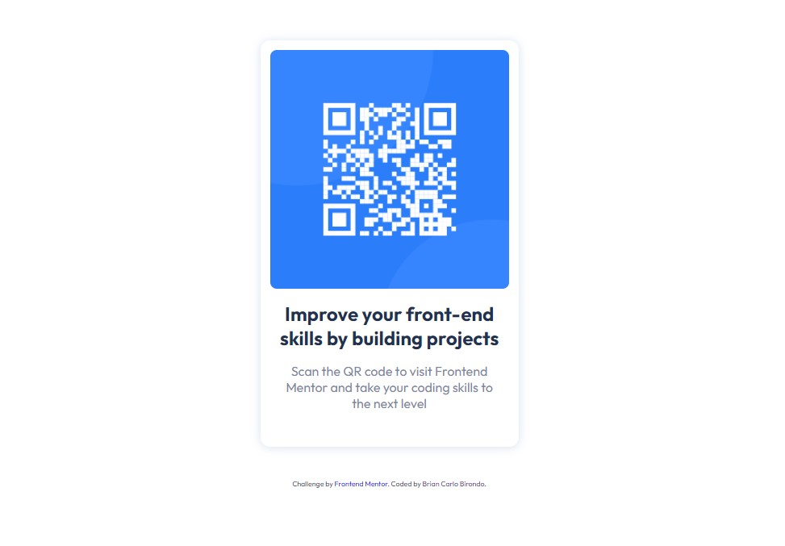

# Frontend Mentor - QR code component solution

This is a solution to the [QR code component challenge on Frontend Mentor](https://www.frontendmentor.io/challenges/qr-code-component-iux_sIO_H). Frontend Mentor challenges help you improve your coding skills by building realistic projects.

## Table of contents

- [Overview](#overview)
  - [Screenshot](#screenshot)
  - [Links](#links)
- [My process](#my-process)
  - [Built with](#built-with)
  - [What I learned](#what-i-learned)
  - [Continued development](#continued-development)
  - [Useful resources](#useful-resources)
- [Author](#author)
- [Acknowledgments](#acknowledgments)

## Overview

### Screenshot

### Links

- Solution URL: [Add solution URL here](https://github.com/Briancarlo24/QR-Code-Component.git)
- Live Site URL: [Add live site URL here](https://briancarlo24.github.io/QR-Code-Component/)

## My process

### Built with

- Semantic HTML5 markup
- CSS custom properties
- Flexbox
- Media Queries for responsive design

### What I learned

I didn't learn much from this challenge. However, I was able to practice my frontend coding skills.

### Useful resources

- [Example resource 1](https://www.w3schools.com/) - If every I forget some HTML or CSS syntax I just look up the code here.

## Author

- Frontend Mentor - [@Briancarlo24](https://www.frontendmentor.io/profile/Briancarlo24)
- Github - [@Briancarlo24](https://github.com/Briancarlo24)
